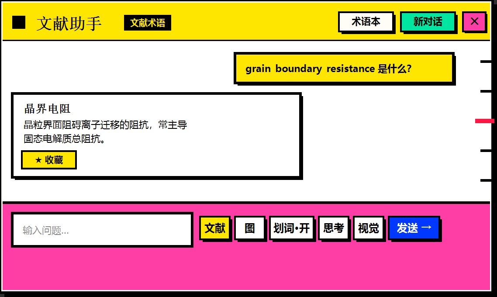

# LitReader · 本地 AI 阅读助手

一个**完全本地运行**的桌面 AI 助手，为「一边读文献一边查专业术语」设计。

按一个热键唤出一个浮窗，划词即问，答完自动归位，不打断你的阅读。
**不调用任何云 API**，你的文献、提问、术语本全部留在自己机器上。

界面采用**新粗野主义（Neo-Brutalism）**风格：硬边缘、粗黑描边、硬偏移阴影、高饱和撞色。



---

## ✨ 功能

### 文献术语模式（默认）
- **划词即问**：在浏览器 / Word / PDF 阅读器里拖动选中文字，松手后**自动读取并发问**，无需复制粘贴
- **术语解释**：回答经过定制提示词约束，先给准确中文定义 → 再讲语境作用 → 必要时补英文全称与类比
- **学术词汇自动入库**：每次回答后异步抽取专业术语，累积到「词汇总表」
- **★ 收藏**：把某个术语一键存入术语本
- **术语本**：侧栏列出所有收藏，点术语可重新提问，**右上角 ✕ 可快捷删除**

### 生活助手模式
- **独立上下文**，与文献模式互不串味
- **跨会话长期记忆**：对话结束（空闲 10 分钟 / 点「新对话」/ 切换模式）后自动总结，落盘存档**并回读注入**下次对话
- 三层记忆结构：滚动总记忆 + 每次会话的独立摘要 + 原始存档

### 通用
- **全局热键**唤出 / 收起（默认 `Alt+Z`，可自动降级）
- **焦点不抢占**：唤出与回答完毕时，键盘焦点都留在你原来的窗口，可直接继续在原文操作
- **消息锚点标尺**：右侧等距横杠 = 每轮问答一个锚点，悬停变红加长，点击跳转
- **平滑非线性滚动**：指数缓动 + 边界阻尼，滚轮有惯性
- **Markdown 渲染**：标题 / 列表 / 引用 / 表格 / 代码块 / 行内样式（零依赖自研渲染器）
- **图片问答**：`Ctrl+V` 粘贴截图或点「图」导入，交给带视觉投影层的模型解析
- **思考模式开关**：关掉可显著提速，需要深挖时再开
- **开机静默启动**：只留托盘图标，按热键才出现

---

## 🖥 环境要求

| 项目 | 要求 |
|---|---|
| 操作系统 | Windows 10 / 11（x64） |
| 编译工具 | MSBuild + WPF 目标（.NET Framework Developer Pack / SDK 或 VS Build Tools） |
| 运行时 | .NET Framework 4.7.2+（Win10/11 系统自带，无需额外安装） |
| 显卡 | **建议 NVIDIA 独显，显存 ≥ 8GB**（用于本地推理） |
| 内存 | 建议 ≥ 16GB |
| 推理引擎 | [Ollama](https://ollama.com/download) |

> 说明：本项目是 **Windows 桌面程序**（WPF + Win32 API），依赖 `SetWindowsHookEx` 全局钩子、UI Automation 与 Win32 窗口操作，**无法在 Linux / macOS 上编译运行**。

---

## 🚀 快速开始

### 1. 安装 Ollama 并拉取模型

```powershell
# 从 https://ollama.com/download 安装后：
ollama pull qwen3.5:9b
```

> **提示**：模型名可自定义，见下文「配置」。
> 若你的网络无法访问 `registry.ollama.ai`，可改用 ModelScope 下载 GGUF 后本地导入。

### 2. 编译

```powershell
powershell -ExecutionPolicy Bypass -File scripts\build.ps1
```

若你的 .NET Framework 不是 4.8：

```powershell
powershell -ExecutionPolicy Bypass -File scripts\build.ps1 -TargetFramework v4.7.2
```

### 3. 安装并创建快捷方式

```powershell
powershell -ExecutionPolicy Bypass -File scripts\install-app.ps1
```

默认安装到 `%LOCALAPPDATA%\LitReader`，可用 `-InstallDir` 指定：

```powershell
powershell -ExecutionPolicy Bypass -File scripts\install-app.ps1 -InstallDir "D:\Apps\LitReader"
# 需要开机自启（静默启动，只留托盘图标）时加 -AutoStart
```

### 4. 让 Ollama 开机自启（可选但推荐）

Ollama 自带的托盘程序**不会继承自定义环境变量**，重启后可能去找错误的模型目录，导致每次提问都卡住。这个脚本会修正它：

```powershell
powershell -ExecutionPolicy Bypass -File scripts\setup-ollama-autostart.ps1
# 自定义路径：
#   -OllamaExe "D:\Ollama\ollama.exe" -ModelsDir "D:\Ollama\models"
```

---

## 🎮 使用

| 操作 | 说明 |
|---|---|
| **`Alt+Z`** | 唤出 / 收起浮窗（`Win+Z` 被系统贴靠布局占用，故默认用 `Alt+Z`） |
| **拖动选中文字** | 自动读取并发问（浏览器 / Word / 阅读器有效） |
| `Esc` | 收起浮窗 |
| `Ctrl+V` | 粘贴截图提问 |
| `Enter` / `Shift+Enter` | 发送 / 换行 |
| **右侧横杠** | 每轮问答一个锚点，悬停变红，点击跳到该轮 |
| 「文献 / 生活」 | 切换模式（上下文独立） |
| 「术语本」 | 展开术语本侧栏 |
| 「★ 收藏」 | 收藏该轮提问里的术语 |
| 术语条 **✕** | 从术语本删除该术语 |
| 「思考」 | 开关思考模式（关掉显著提速） |
| 「视觉」 | 切换带视觉投影层的模型 |
| 托盘图标 | 双击唤出，右键退出 |

### 配置文件

程序首次运行会在**自身目录**生成 `config.txt`：

```ini
# 数据目录：长期记忆、学术词汇、术语本都存放在这里
DataDir=...\LitReader\data

# Ollama 服务地址
OllamaBase=http://127.0.0.1:11434
```

也可用环境变量覆盖（优先级高于配置文件）：

```powershell
$env:LITREADER_DATA_DIR = 'D:\MyData'
$env:LITREADER_OLLAMA   = 'http://127.0.0.1:11434'
```

改模型名请编辑 `src/FloatWindow.xaml.cs` 顶部：

```csharp
const string ModelText   = "lit-reader";        // 文本模型
const string ModelVision = "lit-reader-vision"; // 带视觉投影层的模型
const int    CtxText     = 16384;               // 文本上下文
const int    CtxVision   = 8192;                // 视觉上下文（更吃显存）
```

创建自定义模型（含术语解释人设）：

```powershell
ollama create lit-reader -f Modelfile
```

`Modelfile` 示例：

```
FROM qwen3.5:9b
PARAMETER num_ctx 16384
PARAMETER temperature 0.3
SYSTEM """
你是一位学术文献阅读助手，专长是解释各学科的专业术语。
先用一句话给出准确中文定义，再说明它在当前文献语境中的作用，
必要时补充英文全称与类比。不确定时明确说明存在歧义，绝不编造。
"""
```

### 数据目录结构

```
<程序目录>\data\
├── 学术词汇\
│   ├── 词汇总表.md          # 自动抽取累积，按术语去重
│   ├── 我的收藏.md          # ★ 收藏的术语
│   └── 会话记录\            # 每次抽取的原始存档
└── 生活\
    ├── 长期记忆.md          # 滚动记忆，下次会话会注入上下文
    └── 会话记录\            # 每次会话的独立摘要
```

都是纯 Markdown，**可直接编辑或删除**（删掉即等于让 AI 忘掉）。

---

## 🏗 项目结构

```
src/
├── App.cs                 程序入口：单实例、托盘图标、启动参数
├── AppConfig.cs           配置：数据目录与 Ollama 地址（无硬编码路径）
├── FloatWindow.xaml       界面（新粗野主义样式）
├── FloatWindow.xaml.cs    主逻辑：热键、划词、双模式、记忆、术语本
├── MouseHook.cs           全局鼠标钩子 + 键盘钩子（Esc 兜底）
├── SelectionReader.cs     取选区（UIA TextPattern 优先，Ctrl+C 回退）+ 窗口焦点控制
├── MarkdownRenderer.cs    零依赖 Markdown 渲染器
├── SmoothScroll.cs        非线性平滑滚动
└── LitReader.csproj       MSBuild 工程（WPF，v4.x）
scripts/
├── build.ps1                     编译
├── install-app.ps1               安装 + 快捷方式
└── setup-ollama-autostart.ps1    修正 Ollama 模型目录并配置开机自启
docs/mockups/                     界面设计概念图
```

---

## 🔧 实现要点（踩过的坑）

这些都是实测定位出来的问题与取舍，记录下来供参考：

**1. 浏览器里模拟 `Ctrl+C` 取选区行不通**
Chromium 会检查 `SendInput` 注入事件的 `LLKHF_INJECTED` 标志并**丢弃**合成按键。
改用 **UI Automation 的 `TextPattern`** 直接读选区，绕开键盘与剪贴板，零副作用。
关键陷阱：**不能用 `HasKeyboardFocus` 找元素** —— Chromium 不报告该属性，
必须「遍历树，找支持 `TextPattern` 且选区非空的元素」。

**2. 浮窗一旦成为激活窗口，浏览器就不再暴露选区**
实测：浮窗激活后 `TextPattern` 数量从 540 骤降到 2，划词必然失败。
所以唤出/启动时都用 `SetWindowPos(HWND_TOPMOST, SWP_NOACTIVATE)` ——
**抬到最上层但不抢焦点**，并把焦点还给原来的程序。

**3. `AttachThreadInput` + `SetFocus` 的副作用不会自动撤销**
为发 `Ctrl+C` 而把键盘焦点交给目标程序后，即使释放输入队列连接，
焦点仍留在外部程序 → 表现为「窗口在前台却打不进字」。
必须显式把焦点收回来（或干脆不抢）。

**4. 悬停改边框粗细会让整排按钮"震动"**
按钮宽度是内容自适应的，边框从 2.5px 变 3.5px 会改变尺寸，
`StackPanel` 里后面的按钮全被挤走。改为**叠加一层描边**，零尺寸变化。

**5. WPF 的 `Border` 不裁剪子元素的圆角**
画圆形按钮必须用 `Ellipse` 或让 `Border` 自己带 `CornerRadius`。

**6. 平滑滚动与滚动条拖拽会抢控制权**
自己缓动的同时 `ScrollBar` 也在设偏移 → 位置闪跳。
用「自身滚动预算」精确区分：每次自己滚动前计数 +1，`ScrollChanged` 配对 -1，
配不上就说明是用户拖拽，立即交出控制权。

**7. `MSG` 结构体必须完整声明**
少字段会让 `GetMessageW` 写越界，破坏内存。

---

## ⚠️ 已知限制

- **仅支持 Windows**（依赖 WPF + Win32 全局钩子 + UI Automation）
- **需要 NVIDIA 独显**才能获得可接受的速度；纯 CPU 跑 9B 模型体验很差
- 划词自动发问依赖 **UI Automation**，在部分程序里可能读不到选区（此时会静默跳过，不会误发）
- 视觉模式显存占用高（9B + 投影层约 7GB），8GB 显存下视觉模式的上下文已降到 8192
- 生活助手的「会话结束」按**空闲超时**判定，超时期间若程序退出，本次会话不会被总结

---

## 📄 许可

[MIT](LICENSE) —— 可自由使用、修改、分发。

## 🙏 致谢

- [Ollama](https://ollama.com) —— 本地推理运行时
- [Qwen](https://github.com/QwenLM) —— 默认使用的开源模型
